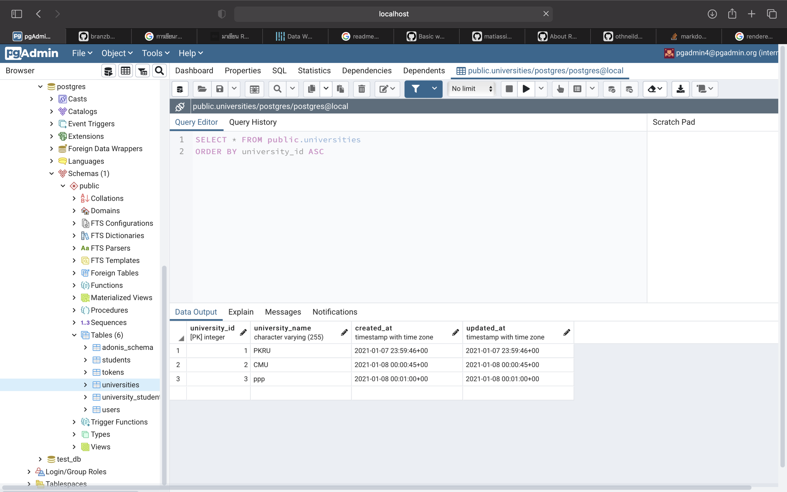
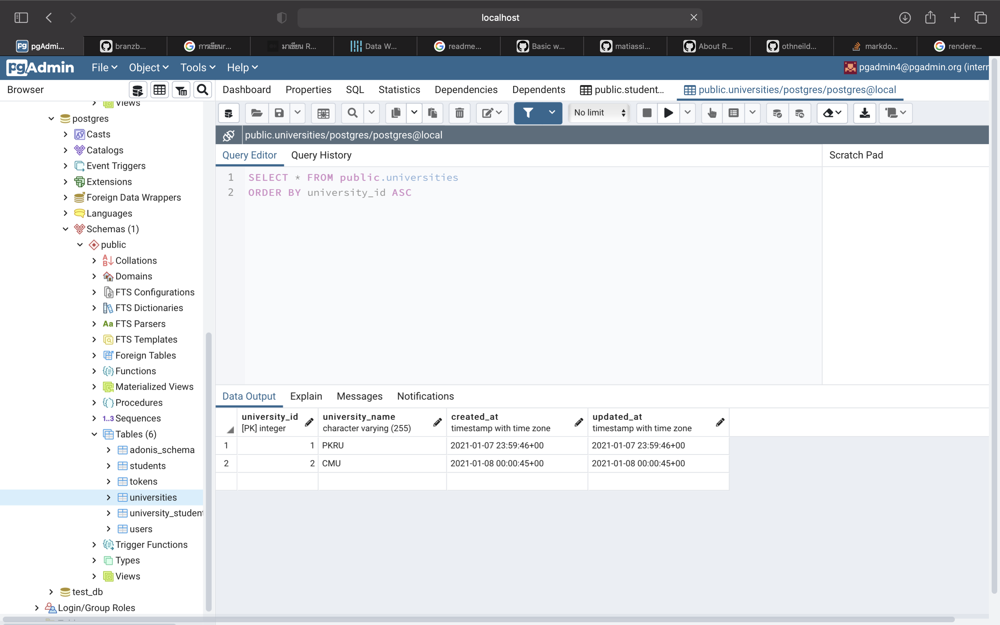
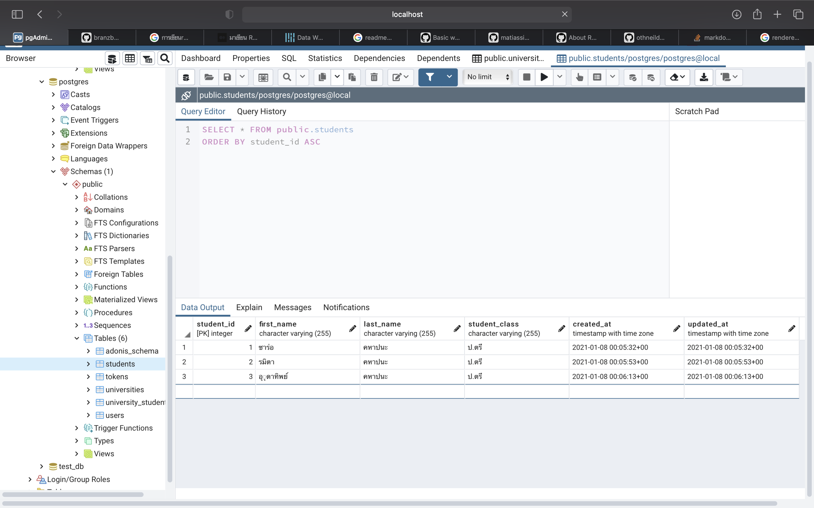
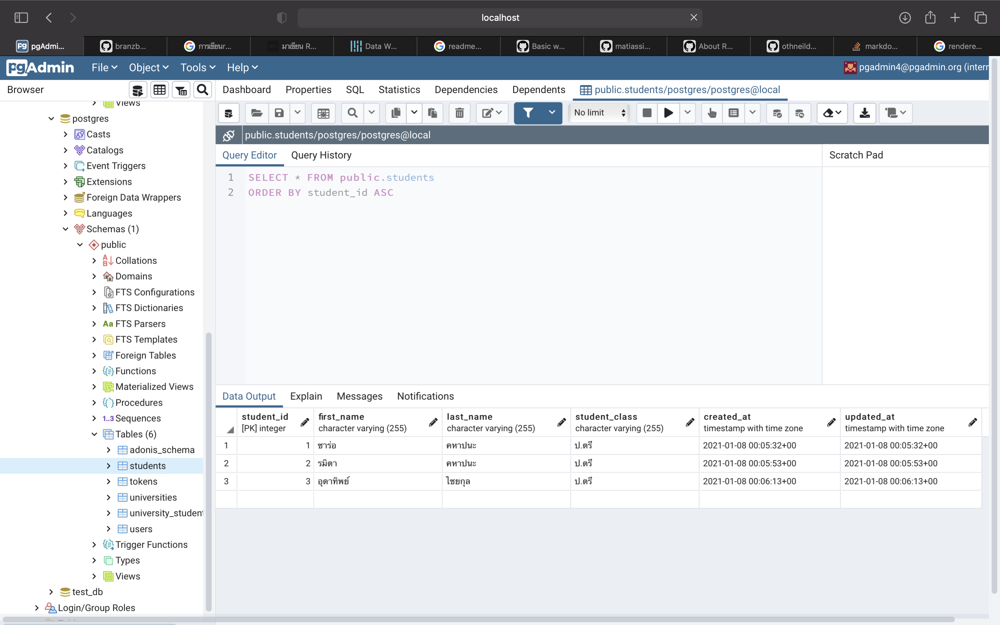
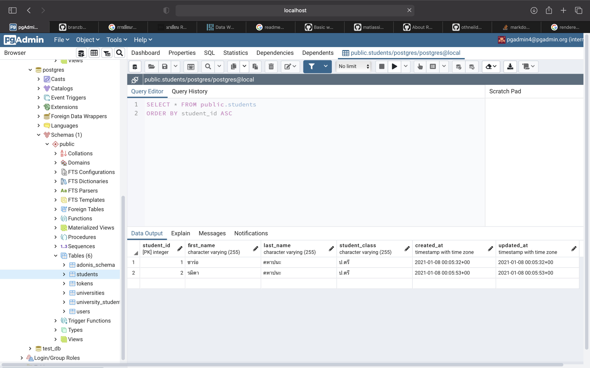

# EXAMPLE DATA OF STUDENT AND UNIVERSITY

## About The Project
The project built to Storing information of university and student  

Core features:
* Storing  data from student input and university 
* Show data of student and university  
* Update data of student and university
* Delete data of student and university 


## Getting Started
The current configuration for Docker or docker-compose requires your machine to build database manually.
### Prerequisites
Please install the following:
​
- AdonisJs
- Docker
- PostgreSql (Database)

### Run the application

Build Adonis
```bash
$ npm i -g @adonisjs/cli
```

Create a new application
```bash
$ adonis new (project name )
```
Run serve of adonisjs
```bash
$ adonis serve --dev
```

Make migration to create teble  
```bash
$ adonis make:migration (table name of HTTP )
```

Make models to link relation 

```bash
$ adonis make:model (model name) 
```

Make controller to make funtion CRUD

```bash
$ adonis make:controller (controller name) 
```

Run with Docker
```bash
$ docker-compose up
```

### DATABASE
Use database is postgresql 
* install postgres or npm
```
npm i pg 
```

## Examples of how a project can be used
### CRUD
### University
### CREATE

#### REQUEST 

Add university to table and add row 

```
medthod: POST http://localhost:3333/api/:version/universities
```

#### RENDERED

```
{
    "status": 200,
    "data": {
        "university_name": "CMU",
        "created_at": "2021-01-07 16:38:28",
        "updated_at": "2021-01-07 16:38:28",
        "university_id": 4
    }
}
```

#### READ

#### REQUEST

Get all from univesity

```
medthod: GET http://localhost:3333/api/:version/universities
```

#### RENDERED

```
{
    "status": 200,
    "data": [
        {
            "university_id": 1,
            "university_name": "PKRU",
            "created_at": "2021-01-07 21:16:49",
            "updated_at": "2021-01-07 21:16:49"
        },
        {
            "university_id": 2,
            "university_name": "CMU",
            "created_at": "2021-01-07 23:38:28",
            "updated_at": "2021-01-07 23:38:28"
        },
        {
            "university_id": 3,
            "university_name": "ppp",
            "created_at": "2021-01-07 21:16:56",
            "updated_at": "2021-01-07 23:39:09"
        }
    ]
}
```
#### REQUEST

Get id from univesity and link foreing key from student

```
medthod: GET http://localhost:3333/api/:version/universities/3
```

#### RENDERED

```
{
    "status": 200,
    "data": [
        {
            "university_id": 3,
            "university_name": "ppp",
            "created_at": "2021-01-07 21:16:56",
            "updated_at": "2021-01-07 23:39:09",
            "students": [
                {
                    "student_id": 2,
                    "first_name": "รมิตา",
                    "last_name": "ชัยกุล",
                    "student_class": "ป.ตรี",
                    "created_at": "2021-01-07 21:17:14",
                    "updated_at": "2021-01-07 21:17:14",
                    "pivot": {
                        "student_id": 2,
                        "university_id": 3
                    }
                },
                {
                    "student_id": 3,
                    "first_name": "รมิตา",
                    "last_name": "คหาปนะ",
                    "student_class": "ป.โท",
                    "created_at": "2021-01-07 21:18:23",
                    "updated_at": "2021-01-07 21:18:23",
                    "pivot": {
                        "student_id": 3,
                        "university_id": 3
                    }
                },
                {
                    "student_id": 7,
                    "first_name": "ซาร่อ",
                    "last_name": "คหาปนะ",
                    "student_class": "ป.ตรี",
                    "created_at": "2021-01-07 21:54:40",
                    "updated_at": "2021-01-07 21:54:40",
                    "pivot": {
                        "student_id": 7,
                        "university_id": 3
                    }
                }
            ]
        }
    ]
}
```

#### UPDATE
#### REQUEST

Select id from univesity to update row of id  

```
medthod: PUT http://localhost:3333/api/:version/universities/3
```

#### RENDERED

```
{
    "status": 200,
    "data": [
        {
            "university_id": 3,
            "university_name": "KU",
            "created_at": "2021-01-07 21:16:56",
            "updated_at": "2021-01-08 06:25:51"
        }
    ]
}
```

* Image of Delete 
  > Before

* Image of Delete 
  > After


#### DELETE
#### REQUEST

Select id from univesity to delete row of id   

```
medthod: DELETE http://localhost:3333/api/:version/universities/3
```

#### RENDERED

```
{
    "status": 200,
    "data": {
        "message": "success"
    }
}
```
* Image of Delete 
  > Before

* Image of Delete 
  > After


## STUDENT
#### CREATE

#### REQUEST 

Add student to table and add row

```
medthod: POST http://localhost:3333/api/:version/students
```

#### RENDERED

```
{
    "status": 200,
    "data": {
        "first_name": "ซาร่อ",
        "last_name": "คหาปนะ",
        "student_class": "ป.ตรี",
        "created_at": "2021-01-07 22:27:10",
        "updated_at": "2021-01-07 22:27:10",
        "student_id": 1
    }
}
```

#### READ

#### REQUEST

Get all from student

```
medthod: GET http://localhost:3333/api/:version/students
```

#### RENDERED

```
{
    "status": 200,
    "data": [
        {
            "student_id": 1,
            "first_name": "ซาร่อ",
            "last_name": "คหาปนะ",
            "student_class": "ป.ตรี",
            "created_at": "2021-01-08 06:45:22",
            "updated_at": "2021-01-08 06:45:22"
        },
        {
            "student_id": 2,
            "first_name": "รมิตา",
            "last_name": "คหาปนะ",
            "student_class": "ป.ตรี",
            "created_at": "2021-01-08 06:45:39",
            "updated_at": "2021-01-08 06:45:39"
        },
        {
            "student_id": 3,
            "first_name": "อุดาทิพย์",
            "last_name": "ไชยกุล",
            "student_class": "ป.ตรี",
            "created_at": "2021-01-08 06:45:56",
            "updated_at": "2021-01-08 06:45:56"
        }
    ]
}

```
#### REQUEST

Get id from student and link foreing key from university

```
medthod: GET http://localhost:3333/api/:version/ustudents/3
```

#### RENDERED

```
{
    "status": 200,
    "data": [
        {
            "student_id": 1,
            "first_name": "ซาร่อ",
            "last_name": "คหาปนะ",
            "student_class": "ป.ตรี",
            "created_at": "2021-01-08 06:45:22",
            "updated_at": "2021-01-08 06:45:22",
            "university": [
                {
                    "university_id": 1,
                    "university_name": "CMU",
                    "created_at": "2021-01-08 06:45:05",
                    "updated_at": "2021-01-08 06:45:05",
                    "pivot": {
                        "university_id": 1,
                        "student_id": 1
                    }
                }
            ]
        }
    ]
}
```

#### UPDATE
#### REQUEST

Select id from student to update row of id  

```
medthod: PUT http://localhost:3333/api/:version/students/1
```

#### RENDERED

```
{
    "status": 200,
    "data": {
        "student_id": 1,
        "first_name": "ศศิกานต์",
        "last_name": "คหาปนะ",
        "student_class": "ป.ตรี",
        "created_at": "2021-01-07T23:45:22.000Z",
        "updated_at": "2021-01-07T23:45:22.000Z"
    }
}
```
* Image of Update 
  > Before

* Image of Update
  > After

#### DELETE
#### REQUEST

Select id from student to delete row of id   

```
medthod: DELETE http://localhost:3333/api/:version/students/3
```

#### RENDERED

```
{
    "status": 200,
    "data": {
        "message": "success"
    }
}
```
* Image of Delete 
  > Before

* Image of Delete 
  > After


